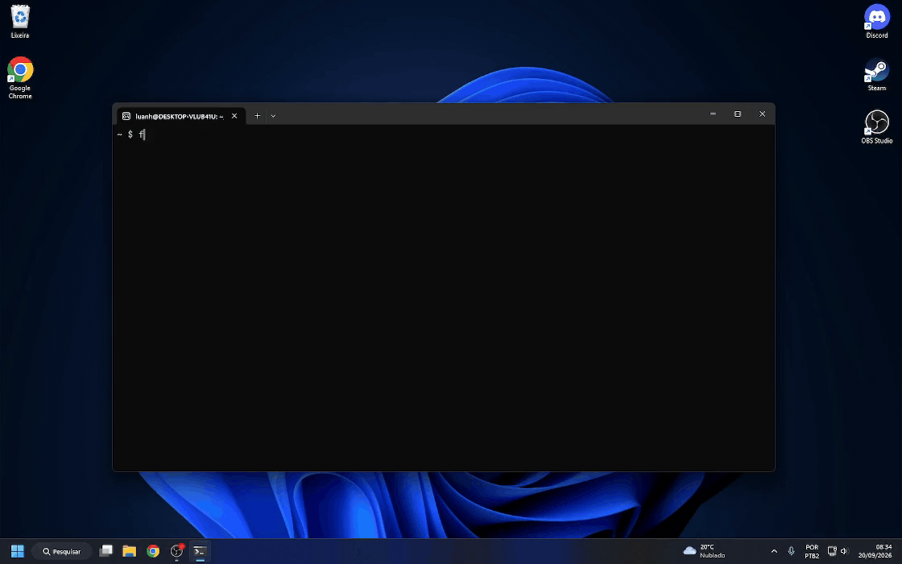

<p align="center">
  
</p>

# FirstMate

[](https://github.com/luanAfons0/FirstMate/actions/workflows/check.yml)
[](LICENSE.md)
[](https://nodejs.org)

FirstMate is a local plugin host. It runs a person's own tools on their own
machine and gives each one a process, a page and an address, so that no tool has
to build a runtime of its own.



## Install it

```sh
npx @luan-afonso/firstmate start
```

That is the whole of it. The Host listens on `http://127.0.0.1:4747/` and
prints the address to open, token and all. To keep the command around:

```sh
npm install -g @luan-afonso/firstmate
firstmate start
```

From a clone instead, which is how you work on the Host itself:

```sh
git clone https://github.com/luanAfons0/FirstMate.git
cd FirstMate
node src/main.ts
```

Node 24 or newer, and nothing else. FirstMate has no runtime dependencies, and
a clone needs no build step.

## Where it runs

Evidence, not a promise. "Proved" means someone has run it.

| Platform        | Host and command line | Plugin Server    | Service           | Tray      |
| --------------- | --------------------- | ---------------- | ----------------- | --------- |
| WSL Debian      | proved                | proved           | proved, systemd   | proved    |
| Linux, native   | should work, untried  | should work, untried | should work, untried | not built |
| macOS           | should work, untried  | should work, untried | not built      | not built |
| Windows, native | should work, untried  | **will not run** | not built         | not built |

**Native Windows will not run a Plugin Server.** That is a fact about the code,
not a guess: the Supervisor checks the executable bit with `access(path, X_OK)`
and then spawns the Plugin's `mcp` file directly, and Windows reads no shebang.
The other half is unaffected — the Host still serves that Plugin's `web/`
directory byte for byte, so its Plugin Page works.

The service is a systemd unit, so it is Linux only. The Tray is a Windows
program and reads the runtime file over a `\\wsl.localhost\` path, so it is
WSL-bound by construction. Neither is a judgement about the other platforms;
nobody has written those halves (ADR-0007).

A Plugin is a directory and nothing more. Put a `web/` folder in it and the Host
serves it as a Plugin Page. Put an executable named `mcp` in it and the Host
starts that Plugin Server. A directory with neither is still a Plugin; it just
has nothing to show.

The words this project uses are defined in [`CONTEXT.md`](CONTEXT.md). The
decisions that are expensive to reverse are in [`docs/adr/`](docs/adr).

## What a Plugin is

A directory, named in the Registry. There is no manifest and no schema.

| In the directory   | What the Host does with it                                  |
| ------------------ | ----------------------------------------------------------- |
| `web/`             | Serves it at `/p/<name>/`, byte for byte.                   |
| `mcp` (executable) | Runs it, and speaks MCP to it over stdin and stdout.        |

The shebang of `mcp` decides the language, so a Plugin Server can be written in
anything. Its output goes to the Host's own output, which under systemd is the
journal.

A Plugin is in one of three states, and the Index Page shows which:

| State              | What it means                                              |
| ------------------ | ---------------------------------------------------------- |
| `Running`          | The Plugin Server is up and answered the MCP handshake.     |
| `Stopped`          | The Plugin Server exited, or could not be run at all.       |
| `no Plugin Server` | The Plugin ships no `mcp` file. This is allowed.            |

The Host never starts a Stopped Plugin again, so a broken Plugin stays visible
instead of spinning in a restart loop. A Stopped Plugin still serves its Plugin
Page.

Writing one? [`docs/plugin-guide.md`](docs/plugin-guide.md) states the whole
contract: what the Host enforces, and what it only advises.

## Add a Plugin

```sh
node src/cli.ts add <name> /absolute/path/to/the/directory
node src/cli.ts install /absolute/path/to/the/directory [name]
node src/cli.ts install https://example.com/someone/a-plugin.git [name]
node src/cli.ts remove <name>
node src/cli.ts list
node src/cli.ts grant <from> <to>
node src/cli.ts revoke <from> <to>
```

`install` is `add` for a Plugin you do not have yet. A directory is copied and
a git URL is cloned; either way the files land in the Shelf and `install`
registers what it put there, under the last segment of the source, without its
`.git` suffix, or under the name you give. It runs nothing the Plugin ships —
the Plugin's own executable runs later, when the Host starts it. It refuses a
name already in the Registry and a directory already in the Shelf, and a fetch
that fails leaves the Registry untouched and the Shelf clean. Cloning needs the
`git` binary; nothing else does.

Adding neither copies nor symlinks the directory: the Registry holds the path,
so a Plugin stays in its own repository wherever it already lives. `grant` lets
`<from>` call `<to>`'s tools; a Grant is one way, so it does not let `<to>` call
`<from>`. `revoke` takes that Grant back. Both refuse a Plugin Name that is not
registered. The Host enforces a Grant on every Tool Bus call. The Registry is
read when the Host starts, so restart the Host to pick up a change.

A Tool Bus call may carry a `timeoutMs` saying how long it is allowed to take.
Without one it gets thirty seconds, and `FIRSTMATE_MAX_CALL_MS` is the ceiling:
a call that asks for more is quietly given the ceiling rather than refused. A
Plugin Page's own call is not a Tool Bus call and keeps its thirty seconds.

## Run the Host

```sh
node src/main.ts
node src/cli.ts start   # the same Host, from the command line
```

It listens on `http://127.0.0.1:4747/` and on no other address. `start` boots
the Host that `node src/main.ts` boots: the same environment variables move it,
and it prints the same output. One command line does the whole job, so whoever
installs FirstMate can run what they installed.

## Configure it

| Variable                | Default        | What it moves                                     |
| ----------------------- | -------------- | ------------------------------------------------- |
| `FIRSTMATE_HOME`        | `~/.firstmate` | Where the Registry, the runtime file and the settings live. |
| `FIRSTMATE_PORT`        | `4747`         | The port. Zero asks the system for a free one.    |
| `FIRSTMATE_HANDSHAKE_MS`| `10000`        | How long a Plugin Server has to answer the handshake. |
| `FIRSTMATE_MAX_CALL_MS` | `600000`       | The longest a Tool Bus call may ask the Host to wait. |
| `FIRSTMATE_NOTICE_MS`   | `60000`        | How long the Host holds a Notice for the Tray to read. |
| `FIRSTMATE_SHELF`       | `~/.firstmate/shelf` | The Shelf: where a fetched Plugin lands. |

## The Shelf

The Shelf is the directory a fetched Plugin lands in. Say where it is, or move
it:

```sh
node src/cli.ts shelf                      # where a fetched Plugin lands
node src/cli.ts shelf /absolute/directory  # move it, and remember it
```

The directory has to be there already, and it may not be, hold, or lead to the
Host's home directory, because a fetched Plugin must never be written over the
Registry and the runtime file. What is remembered is the real path, so what you
read back is what FirstMate uses.

The choice is kept in `settings.json` and survives a restart. `FIRSTMATE_SHELF`
beats it, for a test, a script, or a second FirstMate. The Index Page shows the
Shelf in force and names the command that moves it, and that is all it does:
the Shelf is moved from a terminal and from nowhere else, because no address on
the Host changes it
([ADR-0012](docs/adr/0012-the-host-keeps-one-setting.md)). Nothing scans the
Shelf — a directory sitting there is not a Plugin until `add` registers it.

## Shortcuts

A Shortcut is a key combination for all of Windows, bound to one address of one
Plugin. The Tray holds it, and pressing it opens that address in a Popup: a
small window with no frame, on top of every other window.

```sh
node src/cli.ts bind Ctrl+Alt+N worklog new.html  # open /p/worklog/new.html
node src/cli.ts bind Ctrl+Alt+W worklog           # open the Plugin Page
node src/cli.ts unbind Ctrl+Alt+N
node src/cli.ts list                              # the Shortcuts follow the Plugins
```

The keys are one or more of `Ctrl`, `Alt`, `Shift` and `Win`, and one key: a
letter, a digit, `F1` to `F24`, or one of `Space`, `Enter`, `Tab`, `Backspace`,
`Insert`, `Delete`, `Home`, `End`, `PageUp`, `PageDown`, `Up`, `Down`, `Left`
and `Right`. Letter case and modifier order do not matter: `alt+ctrl+n` is
`Ctrl+Alt+N`, and that is how it is kept and shown. Keys with no modifier are
refused, so a plain letter is never taken away from every program.

`bind` refuses a Plugin that is not in the Registry, a path that is absolute or
leaves the Plugin's address, and keys already bound, naming the Plugin that
holds them. `unbind` of keys that are not bound fails. `remove` takes the
Plugin's Shortcuts with it and says which. The Shortcuts are kept in
`settings.json` beside the Shelf, and they are bound from a terminal and from
nowhere else: a Plugin Page cannot set one, because any Plugin could then take
a key in all of Windows
([ADR-0013](docs/adr/0013-shortcuts-are-bound-from-a-terminal-and-held-by-the-tray.md)).

## The home directory

- `registry.json` — the Registry: one row per Plugin, holding its Plugin Name,
  the absolute path of its directory, and its Grants.
- `runtime.json` — the port the Host listened on and the token it minted. It is
  rewritten at every start and removed when the Host stops.
- `settings.json` — the two settings the Host remembers: the Shelf and the
  Shortcuts. It is absent until you choose a Shelf or bind a Shortcut.

## Addresses

| Address              | What it serves                                     |
| -------------------- | -------------------------------------------------- |
| `/`                  | The Index Page: every Plugin, its state, the Shelf. |
| `/plugins.json`      | The same list, for the Tray. Nothing is written.   |
| `/shortcuts.json`    | Every Shortcut and the address it opens, for the Tray. Nothing is written. |
| `/notices.json?after=<n>` | The Notices after `n`, for the Tray. Nothing is written. |
| `/p/<name>/`         | That Plugin's `web/` directory, byte for byte.     |
| `POST /p/<name>/rpc` | That Plugin's tools. The body is an MCP request.   |

A Plugin Page is a whole page: the Host links to it and the browser goes there,
rather than framing it under chrome of its own
([ADR-0008](docs/adr/0008-a-plugin-page-is-a-whole-page.md)).

## Call a Plugin's tools

A Plugin Page calls its own tools with one ordinary request. There is no bridge
API to learn:

```js
const answer = await fetch('rpc', {
  method: 'POST',
  headers: { 'content-type': 'application/json' },
  body: JSON.stringify({ jsonrpc: '2.0', id: 1, method: 'tools/list' }),
});
```

The Host forwards that body to the Plugin's Plugin Server and returns the
answer. A Plugin Page may reach only its own Plugin. From a terminal:

```sh
curl -X POST -H 'content-type: application/json'   -d '{"jsonrpc":"2.0","id":1,"method":"tools/list"}'   "http://127.0.0.1:4747/p/<name>/rpc?token=<token>"
```

## Call another Plugin's tools

A Plugin Server calls another Plugin's tools over the pipe it already speaks
MCP on, and the Host carries the call only under a Grant
([ADR-0009](docs/adr/0009-the-tool-bus-runs-over-the-pipe-the-host-owns.md)).
One JSON-RPC request on its own stdout:

```json
{"jsonrpc":"2.0","id":1,"method":"firstmate/tools/call",
 "params":{"plugin":"other","name":"its-tool","arguments":{}}}
```

`firstmate/tools/list` takes `{"plugin":"other"}` and lists that Plugin's
tools. Both hand back the other Plugin's own answer, unchanged. No Plugin is
ever given the token or the port, because the Host owns the pipe and already
knows who is calling. A Plugin Page holds no end of that pipe and still reaches
its own Plugin and no other.

## Reach it

The Host mints a token when it starts and refuses every request that does not
carry it. The address it prints at startup carries the token once:

```
FirstMate: http://127.0.0.1:4747/?token=<token>
```

Open that address and the Host answers with a host-only `SameSite=Strict`
cookie and sends the browser to the same address without the parameter, so the
relative paths inside a Plugin Page are never disturbed. Every later request is
admitted on the cookie alone.

From a terminal, pass the token on every call:

```sh
curl "http://127.0.0.1:4747/p/<name>/?token=<token>"
```

The Host also refuses a request whose `Host` header it does not answer to, one
carrying an `Origin` that is not its own, one carrying the literal `Origin` of
`null`, and one a foreign site started. Each refusal is a 403 that says which
check it failed.

## Keep it running

The Host is a systemd user service inside WSL Debian, with a Windows Task
Scheduler entry at logon that starts WSL and holds the distribution up. Both
halves, with the exact commands to install and to remove them, are in
[`docs/deploy.md`](docs/deploy.md).

```sh
scripts/install-service.sh          # install and start it
journalctl --user -u firstmate -f   # read it
scripts/uninstall-service.sh        # remove it
```

## Open it from Windows

The Tray is FirstMate's Windows program. It runs on Windows, where the desktop
is, while the Host and every Plugin Server stay in WSL Debian. The two talk over
loopback, which WSL already forwards, so nothing new carries traffic between
them.

`firstmate desktop` opens a window of FirstMate's own and shows the Index Page
in it. A Plugin Page is then a page of FirstMate's own rather than a tab among
thirty others. A narrow strip above the page holds one control, *see the plugin
list*, and the name of what is open. One Plugin Page is open at a time, so
leaving one and coming back loads it again. It works out which distribution
holds the Host and where the Host keeps its home directory, so there is no
address to type and no token to paste; say them yourself when it cannot:

```sh
firstmate desktop
firstmate desktop --distribution Debian --home /home/<user>/.firstmate
```

While it runs, FirstMate is in the notification area. The icon shows whether the
Host is running, and its tooltip names the state and the port. Clicking it opens
the window; closing the window hides it and leaves the icon. The menu opens the
window, lists every Plugin the Host reports, starts or restarts the Host,
toggles start at logon, and quits. A Plugin that ships no Plugin Page is listed
and is not offered, and a Stopped Plugin is still listed. A Host that will not
answer disables the list rather than showing it as empty.

While it runs, it also holds the Shortcuts in all of Windows, and picks up a
Shortcut you `bind` or `unbind` within a few seconds, with no restart. Pressing
one opens its address in a Popup at the center of the screen, on top of every
other window, with the focus in it, whether the FirstMate window is shown or
hidden. The Popup has no frame, asks Windows for no taskbar button, and loads
its page fresh every time. It hides when it loses focus, on Esc, on its own
Shortcut pressed again, and when its page goes to any address other than its
own. That last one is refused, so the Popup never shows a second page, and it
is how a Plugin Page says it is finished: after a save, go to `./`. Esc is held
only while the Popup is shown, and works as always everywhere else.

The Tray asks Windows for exactly the keys you bound, with `RegisterHotKey`,
through a small PowerShell helper, and sees no other key. A key another program
already holds, and a press while the Host is not running, are each said in a
Windows notification.

Start at logon is one file, `FirstMate.vbs` in the Startup folder. Turning it
off deletes exactly that file. Nothing is written to the registry and nothing is
scheduled.

Install it with `windows/install-tray.ps1`, remove it with
`windows/uninstall-tray.ps1`; both are in
[`docs/deploy.md`](docs/deploy.md).

A browser still works. The address still opens, and a Plugin Page is still a
whole page that anything can load. The window is another door, not the only one.

The window belongs on Windows, where the desktop is, and it refuses with a
sentence saying so anywhere else. It is the one part of FirstMate that has a
dependency, and that dependency is imported only when this command runs, so
every other command works on a machine where its native binary will not load
(ADR-0011).

## The first Plugin

`~/.nexus` is FirstMate's first Plugin. The Host serves its `web/` directory as
a Plugin Page with every relative path unchanged, and starts its `mcp` file as
a Plugin Server. Nexus deleted its own listener, its Run File and its tray once
this replaced them, and keeps no copy of any of the three.

The migration is finished. What moved, and what it proved, is written down in
[`docs/nexus-migration.md`](docs/nexus-migration.md). What it taught the next
Plugin is in [`docs/plugin-guide.md`](docs/plugin-guide.md).

## Test it

```sh
node --test
```

Every test boots a real Host against a temporary home directory and drives it
over HTTP. No test imports a module of the Host.

## Check the types

```sh
npm install
npx tsc --noEmit
```

Node 24 runs TypeScript without a build step, so a clone never holds built
output and nothing here compiles. `typescript` checks the types, and compiles
the package on the way to npm and nowhere else (ADR-0010).
