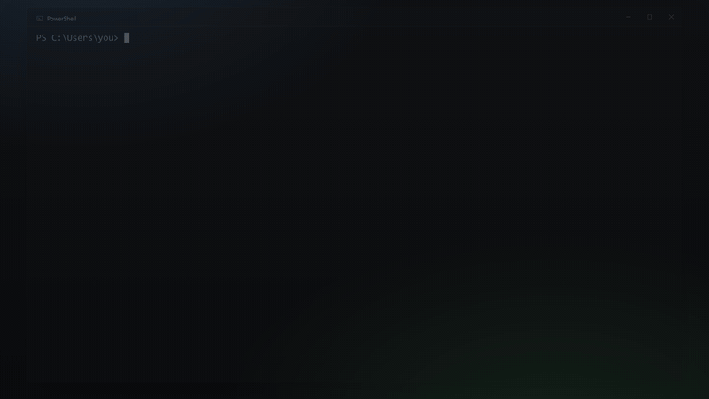

<p align="center">
  
</p>

# FirstMate

[](https://github.com/luanAfons0/FirstMate/actions/workflows/check.yml)
[](LICENSE.md)
[](https://nodejs.org)

FirstMate is a local plugin host. It runs a person's own tools on their own
machine and gives each one a process, a page and an address, so that no tool has
to build a runtime of its own.



## Install it

FirstMate is an App for Windows: one program that holds the Host, the Tray and
the window. Install it with the command line, from Windows or from inside WSL:

```sh
npx @luan-afonso/firstmate desktop
```

`desktop` downloads the App installer of its own version from the GitHub
Release, checks its SHA-256, installs it for you alone with no administrator,
and opens it ([The App](#the-app)). The npm package is the command line and
nothing more: it holds no Host
([ADR-0024](docs/adr/0024-the-npm-package-is-the-command-line-only.md)). To keep
the command around:

```sh
npm install -g @luan-afonso/firstmate
firstmate desktop
```

From a clone instead, which is how you work on FirstMate itself, the Host runs
on plain Node 24 with no build step:

```sh
git clone https://github.com/luanAfons0/FirstMate.git
cd FirstMate
node packages/host/src/main.ts
```

Coming from 1.x? See [Moving from 1.x](#moving-from-1x) and the
[2.0.0 release notes](docs/releases/2.0.0.md).

## Set it up

```sh
firstmate setup
```

`setup` asks a few questions in the terminal and does what you answer, with the
same code the plain commands use, so every step is also a command of its own.
It asks, in order:

1. **The Shelf** of this machine's Place. Enter keeps the one in force. A path
   it refuses is refused in the words `firstmate shelf` uses, and the question
   comes again.
2. **Places.** On Windows and inside WSL, it shows the Places and asks for WSL
   distributions to add as Places, one after another, until Enter. A
   distribution's Place is named after it, as `debian` for `Debian`.
3. **The import.** For each `wsl` Place that holds a 1.x install and no Plugin
   yet, it asks whether to bring it across, as `firstmate import` does.
4. **The [Official Plugins](#official-plugins)**, each with one line about it.
   It fetches the ones you choose by number: `1 3` or `1, 3`, and Enter for
   none. Each goes into a Place it runs in: the only one, or the one you pick.
   One already in the Registry is marked installed and is not offered, one with
   no Place to run in is not fetched and `setup` says why, and a clone that
   fails names the Plugin and the others are still fetched.
5. **Grants**, for each installed Official Plugin that calls others, such as
   `scheduler`. Every other Plugin is on the list; a Grant already given is
   shown and not offered. `setup` gives Grants and never takes one back.
6. **Shortcuts**, one after another: the keys, the Plugin by number, and the
   path, where `/` is the Plugin Page. Enter at the keys ends the step.
7. **Start at logon**, where the App is installed and does not start at logon
   yet. It is off until you say yes. Where the App is not installed, `setup`
   says to run `firstmate desktop`.

When a Host runs and this run changed something, `setup` asks it to reload, as
every plain command does, and asks you nothing.

Each answer is written when it is given, so Ctrl-C keeps the steps that
finished. `setup` never removes anything, so it is safe to run again. A script
can pipe the answers in, one per line; when the input ends before every
question is answered, `setup` stops with "setup ended before it had every
answer" and exits non-zero. A step that fails, such as one clone, lets the
others go on, and `setup` then exits non-zero too. At the end it says what it
changed, and nothing when nothing changed.

## Where it runs

Evidence, not a promise. "Proved" means someone has run it.

| Platform        | App         | Host          | Plugin Server                        | Command line |
| --------------- | ----------- | ------------- | ------------------------------------ | ------------ |
| Windows         | proved      | proved        | proved, from `mcp.cmd` or `mcp.exe`  | proved       |
| WSL, as a Place | —           | —             | proved, through `wsl.exe`            | proved       |
| Linux, native   | not built   | proved by CI  | proved by CI                         | proved by CI |
| macOS           | not built   | should work, untried | should work, untried          | should work, untried |

**The App is Windows only** (ADR-0020). A Plugin in a `wsl` Place keeps its
`mcp` file and runs inside its distribution (ADR-0021). On Windows itself a
Plugin Server starts from `mcp.cmd` or `mcp.exe`, because Windows reads no
shebang (ADR-0019). The Host runs on plain Node anywhere, which is how the tests
run it; only the App, the Tray and the window are Windows programs.

A Plugin is a directory and nothing more. Put a `web/` folder in it and the Host
serves it as a Plugin Page. Put an executable named `mcp` in it and the Host
starts that Plugin Server. A directory with neither is still a Plugin; it just
has nothing to show.

The words this project uses are defined in [`CONTEXT.md`](CONTEXT.md). The
decisions that are expensive to reverse are in [`docs/adr/`](docs/adr).

## What a Plugin is

A directory, named in the Registry. There is no manifest and no schema.

| In the directory   | What the Host does with it                                  |
| ------------------ | ----------------------------------------------------------- |
| `web/`             | Serves it at `/p/<name>/`, byte for byte.                   |
| `mcp` (executable) | Runs it, and speaks MCP to it over stdin and stdout.        |
| `mcp.exe`, `mcp.cmd` | The same, on Windows, where `mcp` is not run.             |

The shebang of `mcp` decides the language, so a Plugin Server can be written in
anything. Windows reads no shebang, so there the Host runs `mcp.exe`, or else
`mcp.cmd` (ADR-0019). Every Plugin Server receives `FIRSTMATE_NODE`, the Node
that runs the Host, so a Node Plugin needs no Node of its own. Its output goes
to the Host's own output and its log: `firstmate logs` prints it (ADR-0022).

A Plugin is in one of three states, and the Index Page shows which:

| State              | What it means                                              |
| ------------------ | ---------------------------------------------------------- |
| `Running`          | The Plugin Server is up and answered the MCP handshake.     |
| `Stopped`          | The Plugin Server exited, or could not be run at all.       |
| `no Plugin Server` | The Plugin ships no `mcp` file of any form. This is allowed. |

The Host never starts a Stopped Plugin again, so a broken Plugin stays visible
instead of spinning in a restart loop. A Stopped Plugin still serves its Plugin
Page.

Writing one? [`docs/plugin-guide.md`](docs/plugin-guide.md) states the whole
contract: what the Host enforces, and what it only advises.

## Add a Plugin

```sh
node apps/cli/src/cli.ts add <name> /absolute/path/to/the/directory
node apps/cli/src/cli.ts install /absolute/path/to/the/directory [name]
node apps/cli/src/cli.ts install https://example.com/someone/a-plugin.git [name]
node apps/cli/src/cli.ts install worklog [name]
node apps/cli/src/cli.ts remove <name>
node apps/cli/src/cli.ts list
node apps/cli/src/cli.ts grant <from> <to>
node apps/cli/src/cli.ts revoke <from> <to>
node apps/cli/src/cli.ts order [<name> <position>]
```

`add` and `install` take `--place <name>` to put the Plugin in a Place other
than the default one. See [Places](#places).

`install` is `add` for a Plugin you do not have yet. A directory is copied and
a git URL is cloned; either way the files land in the Shelf and `install`
registers what it put there, under the last segment of the source, without its
`.git` suffix, or under the name you give. It runs nothing the Plugin ships —
the Plugin's own executable runs later, when the Host starts it. It refuses a
name already in the Registry and a directory already in the Shelf, and a fetch
that fails leaves the Registry untouched and the Shelf clean. Cloning needs the
`git` binary; nothing else does.

Adding neither copies nor symlinks the directory: the Registry holds the path,
so a Plugin stays in its own repository wherever it already lives. `grant` lets
`<from>` call `<to>`'s tools; a Grant is one way, so it does not let `<to>` call
`<from>`. `revoke` takes that Grant back. Both refuse a Plugin Name that is not
registered. The Host enforces a Grant on every Tool Bus call.

Every command that changes the Registry or the settings asks the running Host
to reload, so you never restart FirstMate by hand. A reload starts the Plugins
that were added, stops the ones that were removed, takes the new Grants, and
leaves every other Plugin Server alone. It never starts a Stopped Plugin again.
With no Host running, the command writes the files and says nothing more.

### Official Plugins

The FirstMate project writes a few Plugins of its own, and FirstMate knows
where they are, so `install` takes their Plugin Name in place of a source
(ADR-0015):

| Official Plugin | What it does                                                 |
| --------------- | ------------------------------------------------------------ |
| `worklog`       | Keeps what you work on from one Meeting to the next.          |
| `scheduler`     | Calls one tool of another Plugin at a time you choose.        |
| `nexus`         | Manages the skills and global instructions of Claude and Codex. |

`install` reads a source as a git URL, then as an absolute directory, then as
the name of an Official Plugin. An Official Plugin is cloned from
`https://github.com/luanAfons0/<name>` and is then a Plugin like any other.
`scheduler` calls other Plugins, so it needs a Grant for each one it calls.

A Tool Bus call may carry a `timeoutMs` saying how long it is allowed to take.
Without one it gets thirty seconds, and `FIRSTMATE_MAX_CALL_MS` is the ceiling:
a call that asks for more is quietly given the ceiling rather than refused. A
Plugin Page's own call is not a Tool Bus call and keeps its thirty seconds.

## Places

A Place is where Plugins are installed and their Plugin Servers run
([ADR-0021](docs/adr/0021-plugins-live-in-places.md)). The default Place is this
machine: `windows` on Windows, `local` anywhere else. It is always there, and
`add`, `install` and `shelf` act in it unless `--place` names another.

```sh
node apps/cli/src/cli.ts place                       # every Place, its kind and its Shelf
node apps/cli/src/cli.ts place add <name> <kind>     # add a Place
node apps/cli/src/cli.ts place remove <name>         # take an empty Place away
```

A `local` Place runs its Plugin Servers on this machine. A `wsl` Place is one
WSL distribution, and its Plugins keep their `mcp` file as it is:

```sh
node apps/cli/src/cli.ts place add debian wsl Debian [windows-path]
node apps/cli/src/cli.ts add worklog /home/me/.worklog --place debian
```

The Host starts a `wsl` Plugin as `wsl.exe -d <distribution> --cd <directory>
-- ./mcp`, and reads its files, its Plugin Page among them, through
`\\wsl.localhost\<distribution>` or the Windows path you gave. Its paths are the
distribution's own. A Plugin whose distribution is missing or will not start is
Stopped with one sentence, and nothing retries it. Its default Shelf is
`~/.firstmate/shelf` inside the distribution, and `install` makes the fetched
`mcp` executable there again. `FIRSTMATE_NODE` is not handed across, because it
names a Windows program.

Each Place has its own Shelf: the default Place's is the Shelf below, and any other's is
`shelves/<name>` in the home directory until you move it with
`shelf <directory> --place <name>`. A Plugin Name is used once across every
Place, so `/p/<name>/` is the same address wherever the Plugin runs. A Place
that holds a Plugin is not removed, and removing one touches nothing on disk.

### Moving from 1.x

```sh
node apps/cli/src/cli.ts place add debian wsl Debian
node apps/cli/src/cli.ts import debian
```

`import` reads the 1.x Registry and settings from `~/.firstmate` in that
distribution and brings across every Plugin, its Grants, the Shortcuts, the
Plugin Order and the Shelf. Each Plugin stays where its directory already is,
in the `wsl` Place. A Plugin Name already in use is refused in one sentence, and
the rest still come. When the 1.x Host runs there as a systemd service, `import`
asks before it turns the service off, because the 1.x Host holds the port the
App listens on.

Each Plugin in `registry.json` names its Place. A row with no `place`, as 1.x
wrote it, is in the default Place.

## Ask the running Host

```sh
node apps/cli/src/cli.ts status
node apps/cli/src/cli.ts status --json
node apps/cli/src/cli.ts restart <name>
```

`status` says whether the Host runs, and the state of each Plugin in the Plugin
Order: Running, Stopped, or no Plugin Server. It asks the running Host itself,
over loopback, with the port and the token from `runtime.json`, as the Tray
does. With no Host it says `no Host runs.` and ends with exit code `6`. A
`runtime.json` that a crashed Host left behind names a port nothing answers on,
and that reads as no Host too.

`restart` stops one Plugin's Plugin Server, Stopped or not, and starts it
again, after you fix it. The Host never does this by itself: a broken Plugin
stays Stopped until you say so. It says `restarted <name>. It is Running.`, or
that the Plugin is Stopped and why, which ends with exit code `1`. An unknown
Plugin Name is refused with exit code `4`, and with no Host it says `no Host
runs.` and ends with exit code `6`.

`status`, `list`, `order` and `shelf` say what they read as one JSON value with
`--json`, and print nothing else, so a script can read them. A command that
changes something prints no JSON, and refuses `--json` as typed wrong.

## Read the log

```sh
node apps/cli/src/cli.ts logs      # what the Host and its Plugin Servers said
node apps/cli/src/cli.ts logs -f   # and keep printing new lines
```

The Host keeps its output, and every Plugin Server's stderr with it, in
`firstmate.log` in its home directory
([ADR-0022](docs/adr/0022-the-host-keeps-one-log.md)). The file never grows past
two megabytes: the older half is kept as `firstmate.log.old`, and `logs` prints
it first. The token never reaches either file.

## Help and exit codes

```sh
node apps/cli/src/cli.ts --help
node apps/cli/src/cli.ts <command> --help
```

`--help` or `-h` after any command says how that command is typed and what
its words mean, and does nothing else. A command typed wrong says what is
wrong, then shows that same help.

Every command ends with one of these exit codes, so a script can tell one
refusal from another without reading the sentence:

| Code | What it means                                                         |
| ---- | --------------------------------------------------------------------- |
| `0`  | It did what it was asked.                                             |
| `1`  | It failed: a damaged file, a fetch that went wrong, or a fault.       |
| `2`  | It was typed wrong: no such command, or the wrong words for it.       |
| `3`  | It refused a value that is not what it must be: a Plugin Name, a path, keys, a position. |
| `4`  | It refused a Plugin or a Shortcut that is not there.                  |
| `5`  | It refused a name, keys or a directory that is taken already.         |
| `6`  | It needs a running Host, and none answers.                            |

## Run the Host

```sh
node packages/host/src/main.ts
```

The App runs the Host in its own process. From a clone, this runs the same Host
on plain Node, which is how you work on it and how every test runs it. It
listens on `http://127.0.0.1:4747/` and on no other address, and the same
environment variables move it.

## The App

FirstMate 2.0 is an App: one Windows program that holds the Host and shows the
Index Page in its window (ADR-0020). Each release carries its installer,
`FirstMate-Setup-<version>.exe`, and that file's SHA-256 on the
[GitHub Release](https://github.com/luanAfons0/FirstMate/releases) of its tag,
with the same version as the command line on npm (ADR-0023). Install it from a
terminal on Windows, or inside WSL:

```sh
npx @luan-afonso/firstmate desktop
```

`firstmate desktop` downloads the installer of its own version and its
checksum, and refuses an installer whose SHA-256 does not match: it says so in
one sentence and runs nothing. Then it installs the App silently, for you
alone, with no administrator, and opens it. When that version is installed
already, or a newer one the App updated itself to, it only opens it. It
downloads when you run it, never when the package is installed. From WSL it
saves the installer in the Windows temp folder and runs it, and the App,
through WSL's interop with Windows. Anywhere else it says the App runs on
Windows. It reads which version is installed where the installer records it
for Windows: the App's uninstall key in `HKCU`. `FIRSTMATE_RELEASES_URL` moves
where it downloads from.

Build it yourself from a clone, on Windows:

```sh
pnpm install
pnpm --filter @firstmate/desktop package
```

That writes `apps/desktop/dist/FirstMate-Setup-<version>.exe`, a one-click
installer for you alone that needs no administrator, and the same App,
uninstalled, in `apps/desktop/dist/win-unpacked/`. Both are unsigned, so
Windows may warn before they run.

The App's Host is the Host above: the same home, `%APPDATA%\FirstMate` unless
`FIRSTMATE_HOME` moves it, the same port and the same runtime file, so the
command line reaches it as it reaches any other. Only one App runs for one
home; a second start shows the first window. When another program holds the
port, the App says so and does not start. Closing the window hides it: the
App and every Plugin keep running, and the Tray brings the window back. Quit,
in the Tray's menu, ends the App and stops every Plugin Server. Each Plugin
Server runs on the App's own executable as Node, so a Node Plugin needs no Node
of its own.

The window has the strip at the top: FirstMate, then what is open, which opens
the switcher with every Plugin in the Plugin Order; "open in browser", which
gives what the window shows to your browser; and the gear, which opens the
Settings View. Each Plugin Page you open has a view of its own and stays
loaded until the App quits, so switching to another Plugin and back loses
nothing. A link that leaves FirstMate opens in your browser.

The Settings View shows the Places, each with its Shelf, start at logon, and
the Shortcuts. There you add a Place (a `wsl` one by its distribution), remove
a Place that holds no Plugin, and move a Place's Shelf: type a path, or choose
a folder for a Place on this machine. Each change runs the same check as
`firstmate place` and `firstmate shelf`, and is refused in the same sentence.
The App then has the Host read its settings again. The Host never serves the
Settings View, so no Plugin Page can reach it. Shortcuts, Plugins, Grants and
the Plugin Order change from a terminal.

The Tray is FirstMate's icon in the notification area. It wears the stopped
mark while any Plugin is Stopped. A click on it brings the window up, and its
menu opens the Index Page or any Plugin, turns **Start at logon** on and off,
and quits. Start at logon is off until you turn it on; the App it starts
begins in the Tray, with the window put away.

A Notice shows as a Windows notification under FirstMate's name and mark, and
a click on it opens the sender's address in the window. Windows takes that
name from the installer's Start menu entry, so the unpacked App's Notices are
filed under Electron.

The App holds every Shortcut you `bind`, and picks up a `bind` or `unbind` at
once. Pressing one opens its address in the Popup: a small window with no
frame, on top of the others. It hides when it loses focus, on Esc, on its own
Shortcut again, and when its page goes to any address other than its own.
Keys another program already holds are named in a Notice, never dropped in
silence.

The App updates itself. Five minutes after it starts, and every six hours
after, it looks at the GitHub Releases for a newer version and downloads it in
the background. When it is ready, one Notice says so, and it installs when you
quit FirstMate, never in the middle of work. A stable App follows stable
Releases; a beta follows the newest Release, beta or stable, so a beta tester
lands on the stable version and stays there (ADR-0023). An App you build and
run unpacked from a clone never updates.

A Plugin Page may write to the clipboard, so its "copy" buttons work, but never
read it. It is refused every other permission, camera, location and
notifications among them, except the microphone and a capture of the screen or
a window with its sound. The first time a Plugin asks for one, the App asks you, naming the
Plugin, and keeps your answer under `permissions` in `settings.json`. To be
asked again, take that Plugin out of `permissions`. For a capture, the App
then asks which screen or window to give.

## Configure it

| Variable                | Default        | What it moves                                     |
| ----------------------- | -------------- | ------------------------------------------------- |
| `FIRSTMATE_HOME`        | `~/.firstmate`, or `%APPDATA%\FirstMate` on Windows | Where the Registry, the runtime file and the settings live. |
| `FIRSTMATE_PORT`        | `4747`         | The port. Zero asks the system for a free one.    |
| `FIRSTMATE_HANDSHAKE_MS`| `10000`        | How long a Plugin Server has to answer the handshake. |
| `FIRSTMATE_MAX_CALL_MS` | `600000`       | The longest a Tool Bus call may ask the Host to wait. |
| `FIRSTMATE_NOTICE_MS`   | `60000`        | How long the Host holds a Notice for the Tray to read. |
| `FIRSTMATE_SHELF`       | `~/.firstmate/shelf` | The Shelf: where a fetched Plugin lands. |
| `FIRSTMATE_RELEASES_URL`| `https://github.com/luanAfons0/FirstMate/releases/download` | Where `firstmate desktop` downloads the App from: `<url>/v<version>/FirstMate-Setup-<version>.exe` and its `.sha256`. |

A `_MS` variable is a whole number of milliseconds, from 1 to 2147483647 (about
24 days, the longest wait a Node timer holds). The Host refuses to start on any
other value, and says which.

## The Shelf

The Shelf is the directory a fetched Plugin lands in. Each Place has its own,
and this section is about the default Place's; `--place <name>` says or moves
another's. Say where it is, or move it:

```sh
node apps/cli/src/cli.ts shelf                      # where a fetched Plugin lands
node apps/cli/src/cli.ts shelf /absolute/directory  # move it, and remember it
```

The directory has to be there already, and it may not be, hold, or lead to the
Host's home directory, because a fetched Plugin must never be written over the
Registry and the runtime file. What is remembered is the real path, so what you
read back is what FirstMate uses.

The choice is kept in `settings.json` and survives a restart. `FIRSTMATE_SHELF`
beats it, for a test, a script, or a second FirstMate. The Index Page shows the
Shelf in force and names the command that moves it, and that is all it does:
the Shelf is moved from a terminal or the App's Settings View and from nowhere
else, because no address on the Host changes it
([ADR-0012](docs/adr/0012-the-host-keeps-one-setting.md)). Nothing scans the
Shelf — a directory sitting there is not a Plugin until `add` or `install`
registers it.

## Shortcuts

A Shortcut is a key combination for all of Windows, bound to one address of one
Plugin. The Tray holds it, and pressing it opens that address in a Popup: a
small window with no frame, on top of every other window.

```sh
node apps/cli/src/cli.ts bind Ctrl+Alt+N worklog new.html  # open /p/worklog/new.html
node apps/cli/src/cli.ts bind Ctrl+Alt+W worklog           # open the Plugin Page
node apps/cli/src/cli.ts unbind Ctrl+Alt+N
node apps/cli/src/cli.ts list                              # the Shortcuts follow the Plugins
```

The keys are one or more of `Ctrl`, `Alt`, `Shift` and `Win`, and one key: a
letter, a digit, `F1` to `F24`, or one of `Space`, `Enter`, `Tab`, `Backspace`,
`Insert`, `Delete`, `Home`, `End`, `PageUp`, `PageDown`, `Up`, `Down`, `Left`
and `Right`. Letter case and modifier order do not matter: `alt+ctrl+n` is
`Ctrl+Alt+N`, and that is how it is kept and shown. Keys with no modifier are
refused, so a plain letter is never taken away from every program.

`bind` refuses a Plugin that is not in the Registry, a path that is absolute or
leaves the Plugin's address, and keys already bound, naming the Plugin that
holds them. `unbind` of keys that are not bound fails. `remove` takes the
Plugin's Shortcuts with it and says which. The Shortcuts are kept in
`settings.json` beside the Shelf, and they are bound from a terminal and from
nowhere else: a Plugin Page cannot set one, because any Plugin could then take
a key in all of Windows
([ADR-0013](docs/adr/0013-shortcuts-are-bound-from-a-terminal-and-held-by-the-tray.md)).

## The Plugin Order

Every list of Plugins shows them in the Plugin Order: the Index Page,
`/plugins.json`, the window's switcher and the Tray menu. You choose it.

```sh
node apps/cli/src/cli.ts order            # every Plugin, with its position
node apps/cli/src/cli.ts order worklog 1  # move worklog to the top
```

A position counts from 1 at the top, and the other Plugins keep their order. A
Plugin you never moved follows the ones you did, in the order it was added, so
a Plugin you add goes to the bottom. `order` refuses a Plugin that is not in the
Registry and a position outside the list. The order is kept in `settings.json`
under `order`, and the Host reads it on every request, so a new order shows
within a few seconds with no restart. `remove` takes the Plugin out of it, and
`list` keeps Registry order. The order changes from a terminal alone; no
address on the Host changes it
([ADR-0016](docs/adr/0016-the-operator-chooses-the-plugin-order.md)).

## The home directory

- `registry.json` — the Registry: one row per Plugin, holding its Plugin Name,
  the absolute path of its directory, and its Grants.
- `runtime.json` — the port the Host listened on and the token it minted. It is
  rewritten at every start and removed when the Host stops.
- `settings.json` — the settings FirstMate remembers: the Shelf, the Places,
  the Shortcuts, the Plugin Order, and the App's permission answers. It is
  absent until you choose one of them.

## Addresses

| Address              | What it serves                                     |
| -------------------- | -------------------------------------------------- |
| `/`                  | The Index Page: every Plugin, its state, the Shelf. |
| `/plugins.json`      | The same list, for the Tray. Nothing is written.   |
| `/shortcuts.json`    | Every Shortcut and the address it opens, for the Tray. Nothing is written. |
| `/notices.json?after=<n>` | The Notices after `n`, for the Tray. Nothing is written. |
| `/p/<name>/`         | That Plugin's `web/` directory, byte for byte.     |
| `POST /p/<name>/rpc` | That Plugin's tools. The body is an MCP request.   |
| `POST /reload`       | Read the Registry and the settings again. A terminal only. |
| `POST /restart/<name>` | Start that Plugin's Plugin Server again. A terminal only. |

A Plugin Page is a whole page: the Host links to it and the browser goes there,
rather than framing it under chrome of its own
([ADR-0008](docs/adr/0008-a-plugin-page-is-a-whole-page.md)).

`POST /reload` and `POST /restart/<name>` are the Host's own addresses, for the
command line. Every Plugin Page shares the Host's origin and holds its cookie,
so the Host answers them only
when the request carries no `Origin` and no `Sec-Fetch-Site`: what a browser
always sends and a terminal never does
([ADR-0018](docs/adr/0018-a-terminal-asks-the-host-to-reload.md)).

## Call a Plugin's tools

A Plugin Page calls its own tools with one ordinary request. There is no bridge
API to learn:

```js
const answer = await fetch('rpc', {
  method: 'POST',
  headers: { 'content-type': 'application/json' },
  body: JSON.stringify({ jsonrpc: '2.0', id: 1, method: 'tools/list' }),
});
```

The Host forwards that body to the Plugin's Plugin Server and returns the
answer. A Plugin Page may reach only its own Plugin. From a terminal:

```sh
curl -X POST -H 'content-type: application/json'   -d '{"jsonrpc":"2.0","id":1,"method":"tools/list"}'   "http://127.0.0.1:4747/p/<name>/rpc?token=<token>"
```

## Call another Plugin's tools

A Plugin Server calls another Plugin's tools over the pipe it already speaks
MCP on, and the Host carries the call only under a Grant
([ADR-0009](docs/adr/0009-the-tool-bus-runs-over-the-pipe-the-host-owns.md)).
One JSON-RPC request on its own stdout:

```json
{"jsonrpc":"2.0","id":1,"method":"firstmate/tools/call",
 "params":{"plugin":"other","name":"its-tool","arguments":{}}}
```

`firstmate/tools/list` takes `{"plugin":"other"}` and lists that Plugin's
tools. Both hand back the other Plugin's own answer, unchanged. No Plugin is
ever given the token or the port, because the Host owns the pipe and already
knows who is calling. A Plugin Page holds no end of that pipe and still reaches
its own Plugin and no other.

## Reach it

The Host mints a token when it starts and refuses every request that does not
carry it. The address it prints at startup carries the token once:

```
FirstMate: http://127.0.0.1:4747/?token=<token>
```

Open that address and the Host answers with a host-only `SameSite=Strict`
cookie and sends the browser to the same address without the parameter, so the
relative paths inside a Plugin Page are never disturbed. Every later request is
admitted on the cookie alone.

From a terminal, pass the token on every call:

```sh
curl "http://127.0.0.1:4747/p/<name>/?token=<token>"
```

The Host also refuses a request whose `Host` header it does not answer to, one
carrying an `Origin` that is not its own, one carrying the literal `Origin` of
`null`, and one a foreign site started. Each refusal is a 403 that says which
check it failed.

## Keep it running

The App keeps the Host running for as long as it runs, and it can start at
logon: turn that on from the Tray, or say yes when `setup` asks. Closing the
window keeps the App and every Plugin running; Quit ends them.

## The first Plugin

`~/.nexus` is FirstMate's first Plugin. The Host serves its `web/` directory as
a Plugin Page with every relative path unchanged, and starts its `mcp` file as
a Plugin Server. Nexus deleted its own listener, its Run File and its tray once
this replaced them, and keeps no copy of any of the three.

The migration is finished. What moved, and what it proved, is written down in
[`docs/nexus-migration.md`](docs/nexus-migration.md). What it taught the next
Plugin is in [`docs/plugin-guide.md`](docs/plugin-guide.md).

## Test it

```sh
node --test
```

Every test boots a real Host against a temporary home directory and drives it
over HTTP. No test imports a module of the Host.

## Check it

```sh
pnpm install
pnpm check
```

`pnpm check` checks the types, lints with Biome, checks the layout with
Prettier, looks for dead code with knip, and runs every test. CI runs the same
command. `pnpm typecheck` checks the types alone.

The repository is a pnpm workspace: `packages/core` and `packages/host` are
private, and `apps/cli` is the package on npm. Node 24 runs TypeScript without a
build step, so a clone never holds built output and nothing here compiles.
Packing bundles `apps/cli`, with `core` and `host` inside it, on the way to npm
and nowhere else (ADR-0017). `pnpm build` makes the same bundle by hand.
`apps/desktop` is the App, and it is the one thing a clone builds: Electron
cannot run a clone's TypeScript. On Windows, `node --test` packages it and
starts the packaged program, so the suite takes about a minute longer there.
